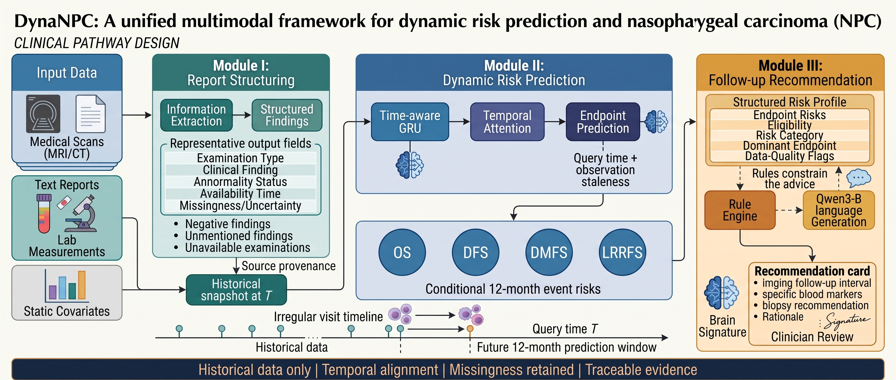
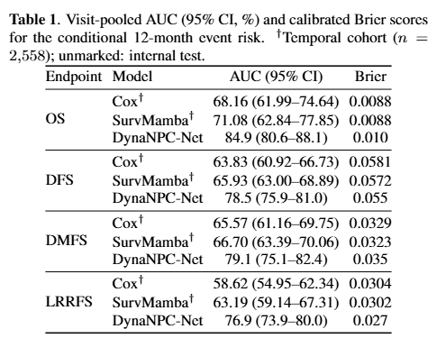
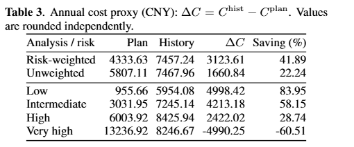
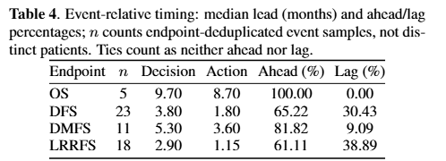

# DYNANPC: A TIME-CONDITIONED MULTIMODAL FRAMEWORK FOR DYNAMIC RISK PREDICTION AND FOLLOW-UP RECOMMENDATION IN NASOPHARYNGEAL CARCINOMA

## 🎯 Overview

Nasopharyngeal carcinoma (NPC) follow-up relies on dynamic, time-varying risk assessment to schedule examinations and detect recurrence early. **DYNANPC** is a time-conditioned multimodal framework that estimates dynamic risk endpoints (DFS, DMFS, LRRFS, OS) from longitudinal clinical, laboratory, EBV-DNA, and imaging data, maps the predicted risk onto evidence-based follow-up intervals and examination panels through a deterministic rule engine, and finally converts the structured decision into an oncologist-readable natural-language recommendation via a large language model (LLM).

The framework separates three stages cleanly: the **model predicts** risk, the **rule engine discretizes** it into follow-up actions, and the **LLM only translates** the deterministic decision into text. Clinical decisions therefore stay reproducible and auditable — the LLM never makes the clinical call.


_Figure 1. Overview of DYNANPC. Multimodal longitudinal inputs (clinical history, physical examination, EBV DNA, laboratory results, and imaging) are fed into a time-conditioned dynamic risk module that estimates 12-month conditional risks. A deterministic rule engine discretizes the predicted risk into follow-up intervals, surveillance directions, and examination panels, with clinical override for safety signals. An LLM then translates the structured decision into a natural-language follow-up recommendation._

## 🕹️ Usage

```bash
conda activate medical
python web_app.py
```

Then open `http://localhost:5000`, register or log in as a doctor, upload a patient Excel file, and open a visit to inspect the risk dashboard and generate the AI follow-up recommendation.

> **Note:** This repository is provided for **demonstration** and ships the web frontend and backend only. The algorithm pipeline (`llm.py` — dynamic risk prediction, prompt assembly, LLM call, and the rule engine) is **not included**.

## 🏅 Experiments

### Quantitative results

<p align="center">
  
</p>

<p align="center">
  
</p>

<p align="center">
  
</p>

### Follow-up recommendation quality

The same rule-engine decision is translated into natural-language follow-up advice by three LLMs. Full outputs are in [`results/`](results/): [DeepSeek](results/deepseek-advice.txt) · [Kimi](results/kimi-advice.txt) · [Qwen](results/qwen-advice.txt).

| Criterion | DeepSeek | Kimi | Qwen |
| --- | --- | --- | --- |
| Leaks chain-of-thought | ✗ No | ✗ No | ✓ Yes (`<think>` block) |
| Triggers urgent evaluation on suspicious MRI | ✓ Yes | ✓ Yes | ✗ No |
| Late-toxicity monitoring | ✓ Detailed | ✓ Detailed | △ Partial |
| Examination de-duplication | ✓ Yes | ✗ No | ✗ No |
| Deterministic rule compliance | ✓ Yes | ✓ Yes | △ Partial |

<!-- ## 📑 Citation
If you find this project useful, please star the repo and cite our paper:
```
```
-->
